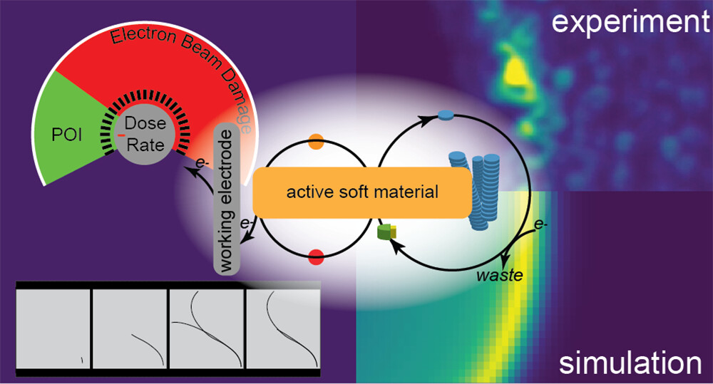

<!---->

<!---->

List of manuscripts on the
<a href="https://arxiv.org/a/0000-0003-2572-2838.html">
arXiv
</a> and published articles on <a href="https://orcid.org/0000-0003-2572-2838">ORCID</a>.

<!--
<em>Review: Geometric perspective on thermodynamic uncertainty relations and speed limits</em> Jason R. Green
Under revision

-->

<em>Thermodynamic speed limits from the regression of information</em> 
Schuyler B. Nicholson, Jason R. Green 
Under revision 
<a href="https://arxiv.org/abs/2105.01588" target="_blank">arXiv</a>
<!--

<b>Summary</b>

<blockquote style="margin-left:10%; margin-right:10%;background-color:#f5f5f5">-->

We show how thermodynamic uncertainty relations and speed limits on nonequilibrium processes derive from linear regression. Using optimal linear models, we show that physical observables give predictions of the equation of motion on statistical manifolds.

<!--</blockquote>

-->

<a href="https://doi.org/10.1103/PhysRevE.111.054130">Phase space contraction rate for classical mixed states</a> 
Mohamed Sahbani, Swetamber Das, Jason R. Green  <em>Phys. Rev. E</em> <strong>2025</strong> In press 
<a href="http://arxiv.org/abs/2502.09361" target="_blank">arXiv</a>

<a href="https://doi.org/10.1002/anie.202502197">Avoiding the Kauzmann paradox via interface-driven divergence in states</a> 
Andrew Martin, Jason R. Green, Martin M. Thuo 
<em>Angew. Chem. Int. Ed.</em> <strong>2025</strong> e202502197 
<a href="https://doi.org/10.1002/anie.202509577">Inside Front Cover</a> 

Complexity in surfaces due to compositional self-organization generates a thermodynamic stress tensor that stretches the phase landscape, realizing previously inaccessible relaxation pathways. This surface driven control over thermodynamic speed limit and momentum creates a potential resolution for the Kauzmann paradox through divergence in entropy. More information can be found in the Research article by Martin Thuo, Andrew Martin, and Jason R. Green (e202502197).


<a href="https://doi.org/10.1103/PhysRevResearch.7.L012078">Dissipation rates from experimental uncertainty</a> 
Aishani Ghosal, Jason R. Green 
<em>Phys. Rev. Res. (Letter)</em> <strong>2025</strong> 7(1) L012078 
<a href="https://doi.org/10.48550/arXiv.2406.05333" target="_blank">arXiv</a>

Reparameterizing the speed limit set by the Fisher information, we show how to infer dissipation rates from directly observable quantities without an analytically solvable model or full time-dependent probability distribution.


<a href="https://doi.org/10.1088/1751-8121/ad8f06">Spectral bounds on the entropy flow rate and Lyapunov exponents in differentiable dynamical systems</a> 
Swetamber Das, Jason R. Green 
<em>J. Phys. A: Math. Theor.</em> <strong>2025</strong> 58(3) 035003 <a href="http://arxiv.org/abs/2501.04485" target="_blank">arXiv</a>

<a href="https://journals.aps.org/pre/abstract/10.1103/PhysRevE.109.L052104">Maximum speed of dissipation</a> Swetamber Das, Jason R. Green <em>Phys. Rev. E (Letter)</em> <strong>2024</strong> 109(5) L052104 <a href="https://arxiv.org/abs/2305.12047" target="_blank">arXiv</a>

     
 

<a href="https://doi.org/10.1021/acsnano.4c01524">Observing the dynamics of an electrochemically driven active material with liquid electron microscopy</a> Wyeth S. Gibson, Justin T. Mulvey, Swetamber Das, Serxho Selmani, Jovany G. Merham, Alexander M. Rakowski, Eric Schwartz, Allon I. Hochbaum, Zhibin Guan, Jason R. Green, Joseph P. Patterson <em>ACS Nano</em> <strong>2024</strong> 18(18) p. 11898–11909

<!--
 

-->

<a href="https://doi.org/10.1039/D3SC05790A" target="_blank">CryoEM reveals the complex self-assembly of a chemically driven disulfide hydrogel</a> 
Paul Joshua Hurst, Justin T. Mulvey, Rebecca A. Bone, Serxho Selmani, Redford F. Hudson, Zhibin Guan, Jason R. Green, Joseph P. Patterson 
<em>Chemical Science</em> <strong>2024</strong> 15(3), p. 1106-1116

<a href="https://doi.org/10.1063/5.0165484" target="_blank">Classical Fisher information for differentiable dynamical systems</a> 
Mohamed Sahbani, Swetamber Das, Jason R. Green <em>Chaos</em> <strong>2023</strong> 33(10) p. 103139 
<a href="https://arxiv.org/abs/2307.00026" target="_blank">arXiv</a>

<a href="https://doi.org/10.1063/5.0142589" target="_blank">Prevalence of multistability and nonstationarity in driven chemical networks </a>Zachary G. Nicolaou, Schuyler B. Nicholson, Adilson E. Motter, Jason R. Green <em>J. Chem. Phys.</em> <strong>2023</strong> 158(22) p. 225101
<!--

<b>Summary</b>

<blockquote style="margin-left:10%; margin-right:10%;background-color:#f5f5f5">
</blockquote>

-->

Numerous biological and artificial processes exploit multistability and nonstationarity in networks of chemical reactions to achieve important functions. While thermodynamic driving and autocatalysis are known to give rise to such complex chemical behaviors in specific systems, it is unclear how general these mechanisms are in more generic chemical networks. Synthesizing knowledge from systems chemistry, network theory, and dynamical systems, we characterize general conditions leading to complexity in driven chemical networks. Our results will enable the design of synthetic chemical reactions and may provide insights into the origins of life.


<a href="https://doi.org/10.1515/jnet-2022-0104" target="_blank">Relations between timescales of stochastic thermodynamic observables</a> Erez Aghion, Jason R. Green <em>J. Non-Equilib. Thermodyn.</em> <strong>2023</strong> 48(4) p. 417-432

<a href="https://doi.org/10.1088/1751-8121/acb5d6" target="_blank">Thermodynamic speed limits for mechanical work</a> Erez Aghion, Jason R. Green <em>J. Phys. A: Math. Theor.</em> <em>(Letter) </em><strong>2023</strong> 56(5) p. 05LT01<strong> </strong><a href="http://arxiv.org/abs/2204.10368" target="_blank">arXiv</a>

     
 
  
<a href="https://link.aps.org/doi/10.1103/PhysRevResearch.5.L012016" target="_blank">Speed limits on deterministic chaos and dissipation</a> Swetamber Das, Jason R. Green <em>Phys. Rev. Res. (Letter)</em> <strong>2023</strong> 5(1) p. L012016<strong> </strong><a href="https://arxiv.org/abs/2110.06993" target="_blank">arXiv</a>

<!--
 

-->

<a href="https://doi.org/10.1063/5.0125479" target="_blank">Optimizing dynamical functions for speed with stochastic paths</a> Rebecca A. Bone, Jason R. Green <em>J. Chem. Phys.</em> <strong>2022</strong> 157(22) p. 224101 
<a href="https://zenodo.org/badge/latestdoi/513167718">
Supporting code: </a>

<a href="https://journals.aps.org/pre/abstract/10.1103/PhysRevE.106.054151" target="_blank">Stochastic paths controlling speed and dissipation</a> Rebecca A. Bone, Daniel J. Sharpe, David J. Wales, Jason R. Green <em>Phys. Rev. E</em> <strong>2022</strong> 106(5) p. 054151<strong> </strong><a href="http://arxiv.org/abs/2109.12202" target="_blank">arXiv</a> 
<a href="https://zenodo.org/badge/latestdoi/280687280">Supporting code: </a>
<!--

<b>Summary</b>

<blockquote style="margin-left:10%; margin-right:10%;background-color:#f5f5f5">
</blockquote>

-->

Thermodynamic intuition suggests that fast, irreversible processes will dissipate more energy and entropy than slow, quasistatic processes connecting the same initial and final states. Here, we show that this intuition does not necessarily hold for stochastic processes when there are strong nonequilibrium currents.


<a href="https://doi.org/10.1063/5.0106714" target="_blank">Dynamic scaling of stochastic thermodynamic observables for chemical reactions at and away from equilibrium</a> Shrabani Mondal, Jonah S. Greenberg, Jason R. Green <em>J. Chem. Phys.</em> <strong>2022 </strong>157(19) p. 194105<strong> </strong><a href="http://arxiv.org/abs/2101.01613" target="_blank">arXiv</a>

<a href="https://link.aps.org/doi/10.1103/PhysRevE.106.054135" target="_blank">Density matrix formulation of dynamical systems </a>Swetamber Das, Jason R. Green <em>Phys. Rev. E</em> <strong>2022</strong> 106(5) p. 054135<strong> </strong><a href="https://arxiv.org/abs/2106.05911" target="_blank">arXiv</a>
<!--

<b>Summary</b>

<blockquote style="margin-left:10%; margin-right:10%;background-color:#f5f5f5">
</blockquote>

-->

We derive a theory for any classical dynamical system that is analogous to the density matrix formulation of quantum mechanics. Defining states in terms of a classical density matrix leads to generalizations of Liouville's theorem and Liouville's equation, establishing an alternative computationally-tractable foundation for nonequilibrium statistical mechanics.


<a href="https://journals.aps.org/prx/abstract/10.1103/PhysRevX.12.011038">Unifying quantum and classical speed limits on observables</a> Luis Pedro García-Pintos, Schuyler B. Nicholson, Jason R. Green, Adolfo del Campo, Alexey V. Gorshkov <em>Phys. Rev. X</em> <strong>2022</strong> 12(1) p. 011038 <a href="https://arxiv.org/abs/2108.04261" target="_blank">arXiv</a>
<!--

<b>Summary</b>

<blockquote style="margin-left:10%; margin-right:10%;background-color:#f5f5f5">
</blockquote>

-->

We derive a bound on the speed with which observables of open quantum systems evolve. It divides into Mandelstam and Tamm's original time-energy uncertainty relation and a time-information uncertainty relation recently derived for classical systems, generalizing both to open quantum systems.


<a href="https://journals.aps.org/prresearch/abstract/10.1103/PhysRevResearch.2.043059" target="_blank">Non-normality and non-monotonic dynamics in complex reaction networks</a> Zachary G. Nicolaou, Takashi Nishikawa, Schuyler B. Nicholson, Jason R. Green, Adilson E. Motter <em>Phys. Rev. Res.</em> <strong>2020</strong> 2(4) p. 043059 <a href="https://arxiv.org/abs/2008.09616">arXiv</a>

<a href="https://www.nature.com/articles/s41567-020-0981-y" target="_blank">Time-information uncertainty relations in thermodynamics</a> Schuyler B. Nicholson, Luis Pedro García-Pintos, Adolfo del Campo, Jason R. Green <em>Nat. Phys. </em><strong>2020 </strong>16(12) p. 1211-1215<strong> </strong><a href="https://arxiv.org/abs/2001.05418" target="_blank">arXiv</a> 
<!--

<b>Summary</b>

<blockquote style="margin-left:10%; margin-right:10%;background-color:#f5f5f5">
</blockquote>

-->

Editor summary: “A time–information uncertainty relation in thermodynamics has been derived, analogous to the time-energy uncertainty relation in quantum mechanics, imposing limits on the speed of energy and entropy exchange between a system and external reservoirs."


<a href="https://pubs.acs.org/doi/10.1021/acs.jpca.0c02734">Benchmarking the performance of the ReaxFF reactive force field on hydrogen combustion systems</a> Luke W. Bertels, Lucas B. Newcomb, Mohammad Alaghemandi, Jason R. Green, Martin Head-Gordon <em>J. Phys. Chem. A</em>&nbsp;<strong>2020</strong> 124(27) p.5631–5645

<a href="https://www.nature.com/articles/s41467-019-10040-3" target="_blank">Critical fluctuations and slowing down of chaos</a> Moupriya Das, Jason R. Green <em>Nat. Commun.</em>&nbsp;<strong>2019</strong>&nbsp;10(1) p. 2155 <a href="https://rdcu.be/bBKdb" target="_blank">Full text</a> <a href="https://arxiv.org/abs/1808.03255" target="_blank">arXiv</a>
<!--

<b>Summary</b>

<blockquote style="margin-left:10%; margin-right:10%;background-color:#f5f5f5">
</blockquote>

-->
<!-- It is well known that cooling a fluid to its liquid-vapor critical point will cause a striking transformation -- the fluid will suddenly appear cloudy. But, what happens to the degree of chaos in the molecular motion as the fluid approaches the critical point and begins to practice splitting into liquid and gas? -->
<!--

<b>Summary</b>

<blockquote style="margin-left:10%; margin-right:10%;background-color:#f5f5f5">
</blockquote>

-->

"It is well known that fluids become opaque at the liquid-vapor critical point, but a description of the underlying mechanical instability is still missing. Das and Green leverage nonlinear dynamics to quantify the role of chaos in the emergence of this critical phenomenon."


In chemistry and physics, it is well known that cooling a fluid to its liquid-vapor critical point will cause a striking transformation called critical opalescence -- at this special set of conditions, the fluid suddenly appears cloudy. The hard-earned explanation for this phenomenon is that as it is cooled, the fluid practices splitting into liquid and gas by forming regions of low and high density. Fluctuations and correlations in these regions grow precipitously to macroscopic length scales and scatter light, making the fluid appear opaque. This statistical description has sufficed for towering advances in statistical physics including universal scaling laws and the powerful theoretical machinery of the renormalization group (for which K. Wilson was awarded the Nobel Prize in 1982). Less understood, however, is what impact this critical phenomenon has on the motion of individual molecules. Missing is a complete understanding of the mechanical instability driving the anomalous statistical features of this singular state. That is, we do not currently have an understanding worthy of Gibbs' name for this program -- statistical mechanics. Using theory and computer simulations, we have shed new light on this problem. We have shown that the degree of chaos in the molecular motion is suppressed as the fluid approaches the critical point and begins to practice splitting into liquid and gas.


<a href="https://pubs.acs.org/doi/full/10.1021/acs.jpcb.9b02811" target="_blank">Typical stochastic paths in the dissipative assembly of fibrous materials</a> Schuyler B. Nicholson, Rebecca A. Bone, Jason R. Green <em>J. Phys. Chem. B</em>&nbsp;<strong>2019</strong>&nbsp;123(22) p. 4792-4802 <strong><em>Invited submission to the "Deciphering Molecular Complexity in Dynamics and Kinetics - From the Single Molecule to the Single Cell Level" </em></strong><a href="https://pubs.acs.org/page/jpcbfk/vsi/molecular-complexity" target="_blank">issue</a>

<a href="https://doi.org/10.1103/PhysRevE.98.032106" target="_blank">Nonequilibrium uncertainty principle from information geometry</a> Schuyler B. Nicholson, Adolfo del Campo, Jason R. Green <em>Phys. Rev. E</em>&nbsp;<strong>2018</strong>&nbsp;98(3) 032106 <a href="https://arxiv.org/abs/1801.02242" target="_blank">arXiv</a>

<a href="http://pubs.rsc.org/en/content/articlelanding/2018/cp/c8cp00905h#!divAbstract" target="_blank">Explosion limits of hydrogen-oxygen mixtures from nonequilibrium critical points</a> Lucas B. Newcomb, Michael E. Marucci, Jason R. Green <em>Phys. Chem. Chem. Phys.</em>&nbsp;<strong>2018</strong>&nbsp;20(23) p. 15746-15752 <strong><em>Selected as a 2018 PCCP HOT Article.</em></strong>

<a href="https://link.aps.org/doi/10.1103/PhysRevE.97.012146" target="_blank">Entrance and escape dynamics for the typical set</a> Schuyler B. Nicholson, Jonah S. Greenberg, and Jason R. Green <em>Phys. Rev. E</em>&nbsp;<strong>2018</strong>&nbsp;97(1) 012146&nbsp;

<a href="http://scitation.aip.org/content/aip/journal/jcp/148/4/10.1063/1.5012760" target="_blank">Effects of temperature and mass conservation on the typical chemical sequences of hydrogen oxidation</a> Schuyler B. Nicholson, Mohammad Alaghemandi, Jason R. Green <em>J. Chem. Phys.</em>&nbsp;<strong>2018</strong>&nbsp;148(4) p. 044102&nbsp;

<a href="http://dx.doi.org/10.1039/C7CP04572G" target="_blank">Nonexponential kinetics of ion pair dissociation in electrofreezing water</a> Mohammad Alaghemandi, Volkmar Koller, and Jason R. Green <em>Phys. Chem. Chem. Phys.</em>&nbsp;<strong>2017</strong>&nbsp;19(38) p. 26396-26402

<a href="https://journals.aps.org/prl/abstract/10.1103/PhysRevLett.119.115502" target="_blank">Self-averaging fluctuations in the chaoticity of simple fluids</a> Moupriya Das, Jason R. Green <em>Phys. Rev. Lett.</em>&nbsp;<strong>2017</strong>&nbsp;119(11), p. 115502 
<a href="http://arxiv.org/abs/1705.10901" target="_blank">arXiv</a> <strong><em>Featured on </em></strong><a href="http://physicsbuzz.physicscentral.com/2017/10/quantifying-chaos-to-understand-liquids.html" target="_blank"><strong><em>Physics Buzz</em></strong></a> 

<a href="http://aip.scitation.org/doi/full/10.1063/1.4994265" target="_blank">Nonequilibrium phase coexistence and criticality near the second explosion limit of hydrogen combustion</a> Lucas B. Newcomb, Mohammad Alaghemandi, Jason R. Green <em>J. Chem. Phys.</em>&nbsp;<strong>2017</strong>&nbsp;147(3), p. 034108

<a href="http://pubs.acs.org/doi/abs/10.1021/acs.jpca.7b00249" target="_blank">Ignition in an atomistic model of hydrogen oxidation</a> Mohammad Alaghemandi, Lucas B. Newcomb, Jason R. Green <em>J. Phys. Chem. A</em>&nbsp;<strong>2017</strong>&nbsp;121(8) p. 1686-1692

<a href="http://link.aps.org/doi/10.1103/PhysRevE.95.022102" target="_blank">Extensivity and additivity of the Kolmogorov-Sinai entropy for simple fluids</a> Moupriya Das, Anthony B. Costa, Jason R. Green <em>Phys. Rev. E</em>&nbsp;<strong>2017</strong>&nbsp;95(2) p. 022102

<a href="http://scitation.aip.org/content/aip/journal/jcp/145/8/10.1063/1.4961485" target="_blank">Learning the mechanisms of chemical disequilibria</a> Schuyler B. Nicholson, Mohammad Alaghemandi, Jason R. Green <em>J. Chem. Phys.</em>&nbsp;<strong>2016</strong>&nbsp;145(8) p. 084112

<a href="http://pubs.rsc.org/en/content/articlelanding/2015/cp/c5cp05125h#!divAbstract" target="_blank">Reactive symbol sequences for a model of hydrogen combustion</a> Mohammad Alaghemandi, Jason R. Green <em>Phys. Chem. Chem. Phys.</em>&nbsp;<strong>2016</strong>&nbsp;18(4), p. 2810-2817

<a href="http://scitation.aip.org/content/aip/journal/jcp/142/6/10.1063/1.4907629" target="_blank">Order and disorder in irreversible decay processes</a> Jonathan W. Nichols, Shane W. Flynn, Jason R. Green <em>J. Chem. Phys.</em>&nbsp;<strong>2015</strong>&nbsp;142(6) p. 064113 
<a href="http://arxiv.org/abs/1502.02697" target="_blank">arXiv</a>

<a href="http://scitation.aip.org/content/aip/journal/jcp/141/10/10.1063/1.4895514" target="_blank">Measuring disorder in irreversible decay processes</a> Shane W. Flynn, Helen C. Zhao, Jason R. Green <em>J. Chem. Phys.</em>&nbsp;<strong>2014</strong>&nbsp;141(10) p. 104107 
<a href="http://arxiv.org/abs/1409.2566" target="_blank">arXiv</a>

<a href="http://www.pnas.org/content/110/41/16339.abstract" target="_blank">A relationship between dynamical entropy and energy dissipation far from thermodynamic equilibrium</a> Jason R. Green, Anthony B. Costa, Bartosz A. Grzybowski, Igal Szleifer <em>Proc. Natl. Acad. Sci. USA</em>&nbsp;<strong>2013</strong>&nbsp;110(41) p. 16339-16343

<a href="http://dx.doi.org/10.1016/j.jcp.2013.03.051" target="_blank">Extending the length and time scales of Gram-Schmidt Lyapunov vector computations</a> Anthony B. Costa, Jason R. Green <em>J. Comp. Phys.</em>&nbsp;<strong>2013</strong>&nbsp;246 p. 113-122

<a href="http://dx.doi.org/10.1080/00268976.2012.684894" target="_blank">Chaotic dynamics near steep transition states</a> Jason R. Green, Thomas S. Hofer, David J. Wales, R. Stephen Berry <em>Mol. Phys.</em>&nbsp;<strong>2012</strong>&nbsp;10(15-16) p. 1839-1848

<a href="https://doi.org/10.1063/1.3658642" target="_blank">Characterizing molecular motion in H2O and H3O+ with dynamical instability statistics</a> Jason R. Green, Thomas S. Hofer, R. Stephen Berry, David J. Wales <em>J. Chem. Phys.</em>&nbsp;<strong>2011</strong>&nbsp;135(18) p. 184307

<a href="http://pubs.acs.org/doi/abs/10.1021/jp111843r" target="_blank">When do molecular bowls encapsulate metal cations?</a> Jason R. Green, Robert C. Dunbar <em>J. Phys. Chem. A</em>&nbsp;<strong>2011</strong>&nbsp;115(19) p. 4968-4975

<a href="http://link.aps.org/doi/10.1103/PhysRevE.80.066205" target="_blank">Space-time properties of Gram-Schmidt vectors in classical Hamiltonian evolution</a> Jason R. Green, Julius Jellinek, R. Stephen Berry <em>Phys. Rev. E</em>&nbsp;<strong>2009</strong>&nbsp;80(6) p. 066205

<a href="http://pubs.rsc.org/en/Content/ArticleLanding/2005/CP/b418056a" target="_blank">Ion/surface reactions and ion soft-landing</a> Bogdan Gologan, Jason R. Green, Jormarie Alvarez, Julia Laskin, R. Graham Cooks <em>Phys. Chem. Chem. Phys.</em>&nbsp;<strong>2005</strong>&nbsp;7 p. 1490-1500

<a href="http://pubs.acs.org/doi/abs/10.1021/jp046228g" target="_blank">Inverse heavy-atom kinetic isotope effects in chloroalkanes</a> Jason R. Green, R. Graham Cooks <em>J. Phys. Chem. A</em>&nbsp;<strong>2004</strong>&nbsp;108(46) p. 10039-10043

<a href="http://pubs.acs.org/doi/abs/10.1021/jp058296o" target="_blank">References</a> Jason R. Green, R. Graham Cooks <em>J. Phys. Chem. A</em>&nbsp;<strong>2005</strong>&nbsp;109(49) p. 11338

<a href="http://dx.doi.org/10.1016/j.apsusc.2004.03.017" target="_blank">Collisions of organic ions at surfaces</a> R. Graham Cooks, Sung-Chan Jo, Jason R. Green <em>Appl. Surf. Sci.</em>&nbsp;<strong>2004</strong>&nbsp;231-232 p. 13-21

<!---->
