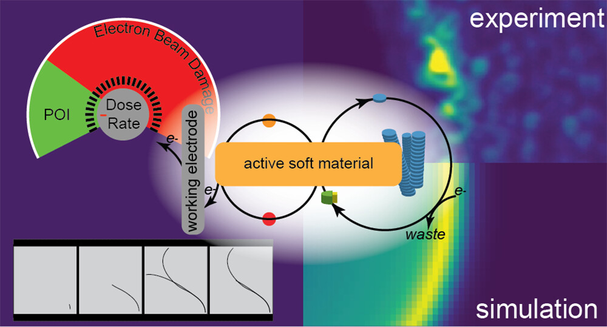

## Controlling the dissipative dynamics of chemically-active materials

Several questions motivate our research: How do we design atom- and energy-efficient syntheses of dynamic forms of matter with tailored functionality?
How do the remarkable properties of living matter emerge from complex correlations of the chemical constituents and their reactions?
Can we control energy and information on the nanoscale to create new materials with a form and function comparable to living systems?

    

        
    

LPTEM image from Gibson et al.

We have made several advances to develop the theory needed to design materials out of equilibrium  and we are working to drive this theory with experimental data.

     
 

<a href="https://doi.org/10.1021/acsnano.4c01524">Observing the dynamics of an electrochemically driven active material with liquid electron microscopy</a> Wyeth S. Gibson, Justin T. Mulvey, Swetamber Das, Serxho Selmani, Jovany G. Merham, Alexander M. Rakowski, Eric Schwartz, Allon I. Hochbaum, Zhibin Guan, Jason R. Green, Joseph P. Patterson <em>ACS Nano</em> <strong>2024</strong> 18(18) p. 11898–11909

<!--
 

-->

<a href="https://doi.org/10.1039/D3SC05790A" target="_blank">CryoEM reveals the complex self-assembly of a chemically driven disulfide hydrogel</a> 
Paul Joshua Hurst, Justin T. Mulvey, Rebecca A. Bone, Serxho Selmani, Redford F. Hudson, Zhibin Guan, Jason R. Green, Joseph P. Patterson 
<em>Chemical Science</em> <strong>2024</strong> 15(3), p. 1106-1116

---

## Thermodynamic speed limits on the rates of dissipation

We are establishing a theory of thermodynamic speed limits, integrating this theory with machine learning, and beginning to guide material design with techniques that respect, and even leverage, this theory.

We have proven that the rates of energy and entropy exchange away from equilibrium are subject to a thermodynamic speed limit; there is an upper bound $$\tau^{-1}$$ on the rate at which heat can be dissipated and entropy can be produced. 
For example, a system that dissipates energy as heat with a rate $$\dot{Q}$$ and is subject to energy fluctuates with a standard deviation $$\Delta\epsilon$$ has the speed limit on the speed of heat flow,
\begin{equation} 
	\tau_{Q}^{-1} := \frac{|\dot{Q}|}{\Delta\epsilon} \leq \sqrt{I_F} =: \tau^{-1}.
\end{equation}
This speed limit holds for heat, dissipated/chemical work and entropy depending on the experimental constraints on the system. In all of these inequalities, the timescale of transient dynamical fluctuations is bounded by the Fisher information. 
They apply to transient systems away from thermodynamic equilibrium, independent of the stochastic dynamics or their function.

<em>Dissipation rates from experimental uncertainty</em> 
Aishani Ghosal, Jason R. Green 
<a href="https://doi.org/10.48550/arXiv.2406.05333" target="_blank">arXiv</a>

<a href="https://journals.aps.org/pre/abstract/10.1103/PhysRevE.109.L052104">Maximum speed of dissipation</a> Swetamber Das, Jason R. Green <em>Phys. Rev. E (Letter)</em> <strong>2024</strong> 109(5) L052104 <a href="https://arxiv.org/abs/2305.12047" target="_blank">arXiv</a>

     
 
  
<a href="https://link.aps.org/doi/10.1103/PhysRevResearch.5.L012016" target="_blank">Speed limits on deterministic chaos and dissipation</a> Swetamber Das, Jason R. Green <em>Phys. Rev. Res. (Letter)</em> <strong>2023</strong> 5(1) p. L012016<strong> </strong><a href="https://arxiv.org/abs/2110.06993" target="_blank">arXiv</a>

<a href="https://www.nature.com/articles/s41567-020-0981-y" target="_blank">Time-information uncertainty relations in thermodynamics</a> Schuyler B. Nicholson, Luis Pedro García-Pintos, Adolfo del Campo, Jason R. Green <em>Nat. Phys. </em><strong>2020 </strong>16(12) p. 1211-1215<strong> </strong><a href="https://arxiv.org/abs/2001.05418" target="_blank">arXiv</a> 

<a href="https://doi.org/10.1103/PhysRevE.98.032106" target="_blank">Nonequilibrium uncertainty principle from information geometry</a> Schuyler B. Nicholson, Adolfo del Campo, Jason R. Green <em>Phys. Rev. E</em>&nbsp;<strong>2018</strong>&nbsp;98(3) 032106 <a href="https://arxiv.org/abs/1801.02242" target="_blank">arXiv</a>

